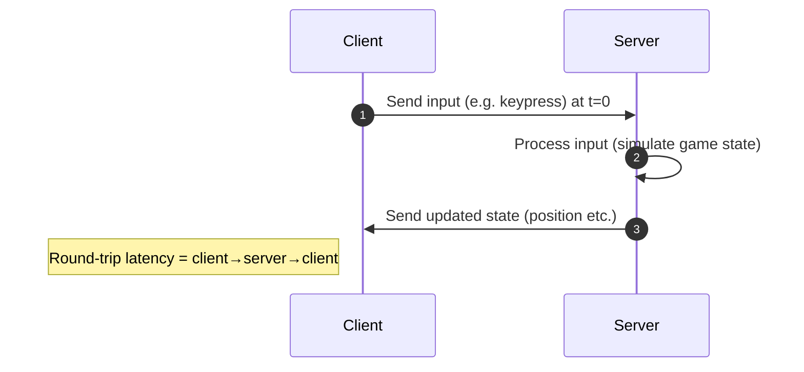
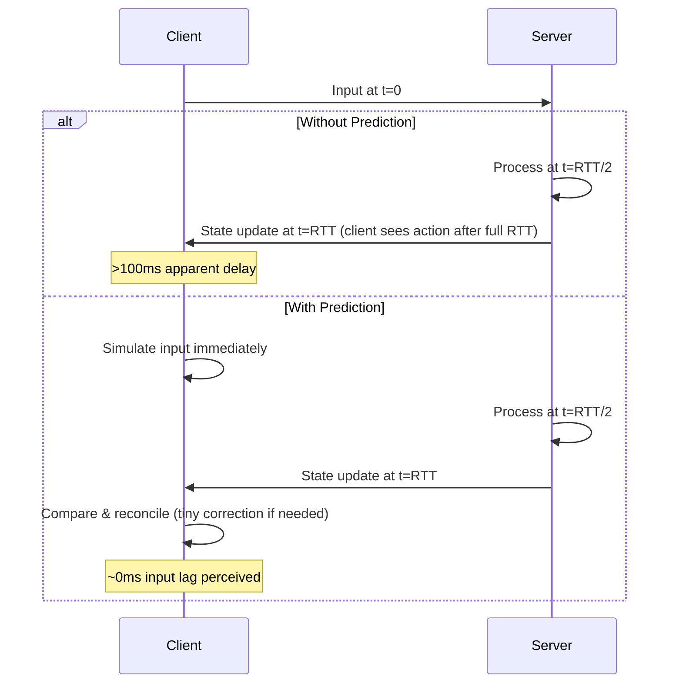

# Optimising Latency in Multiplayer Web Games

**Executive Summary:** Multiplayer web games typically use an **authoritative server** architecture, where clients (browsers) send inputs to a central server which simulates the game state and sends updates back.  Some games use **peer-to-peer (P2P)** or hybrid models (one client hosts) to reduce server load, but these face NAT/firewall issues and security/cheating problems.  In web apps, network transport is critical: **WebSockets over TCP** are widely supported but incur TCP’s head-of-line blocking and handshake overhead.  Newer options like **WebRTC DataChannels** (UDP-based, reliable or partial) or **WebTransport** (QUIC over HTTP/3) allow lower-latency, unordered delivery without TCP blocking.  Latency arises from network round-trip time (RTT), server tick delays, processing, serialization, JS/event-loop delays and rendering. Typical RTTs are tens of ms (local/regional) up to ~100–200 ms across continents.  Mitigations include **client-side prediction** (immediately simulate inputs) and **server reconciliation** (correct mismatches), **interpolation/extrapolation** of remote entities (show others slightly in the past), **lag compensation** (e.g. rewinding state for shooting), and **snapshotting with delta compression** (send only state changes).  Robust design uses binary message formats (Protocol Buffers, MessagePack, flatbuffers) over multiple logical channels (reliable/unreliable, ordered/unordered), with sequence numbers and ACKs in unreliable channels for packet tracking. Trade-offs abound: higher tick-rates and reliability improve consistency and fairness (preventing shooting “through walls”), but cost CPU/bandwidth and can raise latency; unreliable delivery and prediction boost responsiveness but risk visual jitter and state corrections.  Real-world games (e.g. *Apex Legends* at 20 Hz vs *Valorant* at 128 Hz) exemplify these trade-offs.  Popular libraries for web networking include **Socket.IO/engine.io**, **Colyseus**, **Photon Realtime (JS)** and **SimplePeer/WebRTC** libraries.  Below, we analyse architectures, transports, latency sources and mitigations in detail, with examples and diagrams.  

## Common Networking Architectures

- **Client–Server (Authoritative Server):** All clients connect to a central server that runs the game simulation. Clients send user inputs; the server updates the world and sends back state updates. This model, used in games from *Half-Life* to modern FPS, prevents cheating (server enforces rules) and decouples clients’ performance. The server can also maintain multiple regional instances to reduce RTT. *Pros:* Cheat prevention, global view of game state, easy matchmaking. *Cons:* Cost of server hosting (especially at high tick-rate), single point of failure, and every action incurs a round-trip delay to the server.  

- **Peer-to-Peer (P2P):** Every client connects directly to others, exchanging state or inputs (often in a lockstep or peer-sync model). This avoids a dedicated server and can reduce average path length, but is rarely used in fast-paced web games because of NAT/firewall issues (often requiring TURN relays) and security concerns (no trusted authority to prevent cheating). *Pros:* Low cost (no server required), potentially low latency if peers are well-connected. *Cons:* Complex NAT traversal (often fails or needs relays), each client trusts others (cheating, DDoS), and game determinism issues (all peers must maintain exact sync). P2P is more common in turn-based or small-scale games (e.g. some RTS or fighting games) but not in latency-sensitive shooters.  

- **Hybrid/Relay (Peer-as-Host or Mesh with Server Relay):** One client acts as host (authoritative for game logic) while others connect to it, or a dedicated relay server forwards P2P packets (e.g. for NAT punch-through). This can reduce central server costs but inherits most P2P downsides: host machine’s performance and connection quality determine the game’s responsiveness, and if the host cheats or disconnects the game suffers. Relay servers (TURN) can force traffic through a centrally located node – easier than full server simulation but adds extra hop latency and cost.  

**Diagram – Example Client-Server Sequence:**  

## Transport Protocols in Web Applications

- **WebSocket (TCP, ws/wss):** A full-duplex, reliable byte-stream over TCP (RFC6455). It reuses the HTTP handshake (Upgrade header) and then frames binary or text messages. Being over TCP means *in-order, reliable delivery*, but also *head-of-line blocking*: a single lost packet stalls all subsequent messages until retransmission. Encryption (wss) adds a TLS handshake (≈1–2 RTT startup) but negligible per-message overhead. WebSockets are widely supported and simple, and suit chat or turn-based games, but in high-loss or high-packet-rate scenarios their reliability can add significant jitter if packets are dropped.  

- **WebRTC DataChannels (UDP-based):** The WebRTC API enables peer-to-peer *data channels* using SCTP/DTLS over ICE/UDP. DataChannels can be configured as *reliable-ordered* (like TCP) or *partial/unreliable/unordered* (like UDP). In real-time games, one typically uses an unreliable unordered channel for frequent state updates (so lost packets are simply ignored) and a reliable one for critical events or chat. WebRTC’s peer-to-peer nature means in-browser games can connect players directly (bypassing server hops), but initial setup requires ICE negotiation (STUN for NAT traversal) which takes ~100–500 ms and may still fail, forcing a TURN relay. DTLS/SCTP add encryption and some overhead. *Pros:* UDP-like low latency, support for lossy delivery. *Cons:* Complex connection setup (ICE/STUN/TURN), browser compatibility quirks, and no built-in global servers (relies on P2P).  

- **WebTransport (QUIC/HTTP/3):** A newer web API built on HTTP/3 (QUIC) allowing both reliable streams and *unreliable datagrams*. WebTransport streams are ordered and reliable (like multiple TCP connections) but benefit from QUIC’s ability to open streams quickly without extra handshake. Its datagram API provides *unordered, no-retransmit* packets (user datagram) – effectively UDP but encrypted and congestion-controlled. This avoids TCP head-of-line blocking. Compared to WebSockets, WebTransport can reduce latency (QUIC handshake is faster than TCP/TLS) and supports multiplexing into many channels. Unlike WebRTC, WebTransport is client-server only (no P2P). It is promising for game state updates: for example, a browser can send frequent game-state packets via WebTransport datagrams and get sub-10 ms overhead. *Trade-offs:* It’s still new – browser support and mature server implementations lag behind WebSocket.  

**Comparison (sample):**

| Transport | Characteristics | Pros | Cons |
|---|---|---|---|
| **WebSocket (TCP)** | Streams of text/binary over TCP (ws/wss). Ensures ordered, reliable delivery. | Ubiquitous support; simple API. Automatically handles packet loss/retransmit. | Head-of-line blocking (one lost packet stalls all); 1–2 RTT handshake (with TLS); no native partial reliability. |
| **WebRTC DataChannel** | SCTP over DTLS/ICE. Can be reliable-ordered or unreliable-unordered. | UDP-like performance for fast updates; no browser thread limit on connections (P2P). | Complex setup (STUN/TURN); no direct server-to-server mode; can be blocked by strict NAT; heavier initial latency (ICE). |
| **WebTransport (QUIC)** | HTTP/3 streams & datagrams. Streams: reliable, multiple. Datagrams: best-effort UDP-like. | Low-latency handshake (QUIC); no head-of-line on separate streams; built-in congestion control & encryption. | New API (not yet universally supported); client–server only (no peer). |

## Server Infrastructure and Tick Rates

Latency also depends on server placement and update rate:

- **Edge Servers and Regions:** Hosting game servers in multiple regions (North America, Europe, Asia) ensures players connect to a nearby node, minimising RTT. Modern cloud/CDN services can spin up instances close to players on demand. Regional matchmaking directs players to the nearest or most appropriate server cluster to reduce latency.  

- **Tick Rate (Simulation Rate):** The server typically runs a fixed tick loop (e.g. 10–128 Hz) to process inputs and broadcast game state. For example, 60 Hz is a 16.7 ms interval, 30 Hz is 33 ms. Higher tick rates yield smoother, more responsive gameplay (less quantisation delay) but at a high CPU and bandwidth cost. Doubling tick rate roughly doubles CPU usage and outgoing data. Industry examples: *Apex Legends* uses a mere 20 Hz (≈50 ms tick), *Counter-Strike 2* uses 64 Hz with microsecond sub-tick timestamps, while *Valorant* runs at 128 Hz. In general, higher tick rates cut **tick-quantization latency** (server processing delay) roughly by half, at linear cost.  

- **Authoritative Simulation:** By using an authoritative server, the true game state lives on the server. This central simulation means cheating is difficult. Servers may also perform *server-side interpolation* and *lag compensation* before broadcasting state, to mask latency (see below).  

- **Client Update Rate:** The client’s own receive rate also matters. If a client only polls updates at 10 Hz, it effectively sees new data only every 100 ms. Even if the server ticks faster, a low client update rate adds perceivable lag. Unity docs note that the client should send/receive often enough to benefit from the server’s speed (a 60 Hz server is wasted if the client only updates at 10 Hz).  

## Latency Sources and Measurements

Several factors add delay between player input and visible effect:

- **Network RTT:** Propagation delay across the internet. As a rule of thumb, 10,000 km fibre is ~100 ms one-way. Typical global RTTs are ~30–60 ms (local/city-to-city) up to 100–200 ms (intercontinental). For example, Paris–Singapore pinged ~160 ms RTT. Scaleway notes that “most source/destination pairs are within 200–250 ms” and that <60 ms is “good” (<30 ms “perfect”). Excessive jitter or routing hops can add more.  

- **Server Processing Delay:** The time the server takes each tick to process all inputs and physics. Well-optimized server code may simulate a frame in a few milliseconds, but complex scenes or heavy physics can cause delays. If the server misses a tick (too busy), lag spikes occur. Anecdotally, leading games rebuilt engines to meet tight per-tick budgets (e.g. Riot’s Valorant reduced server frame time from 50 ms to ~2 ms).  

- **Tick/Update Interval:** The tick rate itself causes an average delay of half a tick (e.g. 8 ms at 60 Hz, 17 ms at 30 Hz) between a client’s input and when it’s processed, plus half a tick on the outgoing path before next state sent.  

- **Serialization/Packetization:** Converting game state to bytes and sending. On modern hardware, serialising a few fields (positions, states) is usually <1 ms. Packet framing (WebSocket) adds ~2–10 bytes, which is negligible. However, if using JSON, parsing strings can take a few milliseconds; binary formats (protobuf, msgpack, flatbuffers) are far faster and more compact.  

- **Browser/JS Overheads:** In a web game, the client’s JavaScript and browser rendering loop add latency. A typical frame at 60 fps is ~16.7 ms, meaning inputs may not be processed until the next `requestAnimationFrame` tick. Also, heavy rendering or JS logic can block the event loop, causing spikes. Games often separate network handling (Web Workers) or tune the game loop to minimise these delays.  

- **Rendering Latency:** The time to draw a frame on screen (~<16 ms). Some WebGL games double-buffer or use `requestAnimationFrame` to sync. Rendering adds to “perceived latency” but is usually constant.  

In sum, a realistic player-to-server-to-player delay might be **network RTT (e.g. 50–150 ms) + processing (~<5 ms) + rendering (~<16 ms)**. Techniques below aim to hide or compensate for these delays. 

## Latency Compensation and Prediction Techniques

To hide lag, online games use client-side tricks and server algorithms:

- **Client-Side Prediction:** The client instantly applies its input locally while waiting for the server. Gambetta explains: when you press “move,” instead of waiting ~100 ms for a round-trip, the client predicts the new position (assuming the server will agree) and shows it immediately. If predictions usually match server, the player feels no lag. E.g. with 100 ms ping and a 100 ms animation, naive delay is 200 ms, whereas prediction cuts reaction time to near zero. This does not break server authority: the server will still verify the move. *Use case:* virtually all fast-paced games (FPS, racing, action) use prediction for the local player to ensure responsive controls.  

- **Server Reconciliation:** When the server update arrives, it includes the authoritative state and which inputs it has processed (sequence numbers). If the client’s prediction diverged, the client “rewinds” to the server state and replays any unacknowledged inputs locally. In Gambetta’s example, if the client thought it moved 2 units but the server sees it moved only 1, the character snaps back and then replayed the second move. This correction happens behind the scenes so players usually don’t notice as long as discrepancies are small. Sequence numbers or timestamps on inputs are crucial so the server and client stay in sync.  

- **Interpolation of Remote Entities:** Other players’ avatars are not predicted (clients have no input). Instead, clients buffer server snapshots and interpolate positions smoothly. For instance, if server ticks at 10 Hz, the client might always display others **100 ms in the past**. Gambetta describes receiving states at t=900 and t=1000, and rendering the movement from t=900→1000 over the next 100 ms. This yields smooth motion. The downside is a fixed “render delay” (often equal to one tick interval) so others are seen slightly behind real-time. This is usually unnoticeable up to ~100–200 ms. If entities are highly predictable (e.g. cars), clients may extrapolate forward by constant velocity (“dead reckoning”) to compensate for longer intervals.  

- **Lag Compensation (Server-Side Time-Shift):** In first-person shooters, client A sees client B at an older position due to lag. To handle hits reasonably, the server can “rewind” the hit scan. When A shoots, it sends the *timestamp* and aim vector of the shot; the server then rolls back the world to how B was at that timestamp, and checks the shot there. Thus an “unavoidable” shot still counts. This shifts fairness toward the shooter’s perspective, at the cost that a target *might* get shot shortly after they took cover. It’s a trade-off; as Gambetta notes, it’s usually preferable so players don’t miss obvious shots.  

- **Input/Update Buffering:** Clients may need to buffer their own inputs to align with the server tick. For example, the client can throttle input packets to match server tick and avoid bursts. Some games dynamically adjust the client’s send rate so inputs evenly fill server frames. Also, keeping a small queue of inputs on the server ensures smooth simulation even if network jitter causes occasional delays.  

- **Delta Compression & Snapshotting:** Instead of sending full state every tick, servers send **deltas** (only what changed since last snapshot). This drastically cuts bandwidth. For example, only positions of moving entities or changed stats are sent, often packed tightly. Gambetta notes you can send fine-grained “deltas for small movements” or even sampled trajectories. Protocols often encode numeric differences or bitflags for changed fields. Many game servers build a world snapshot each tick and diff it per-client based on interests. 

- **Interest Management:** To reduce unnecessary data, servers send each client only the subset of objects “relevant” to that player (nearby objects, teammates, line-of-sight, etc.). This is crucial for large worlds: a player shouldn’t receive updates about distant zones. For example, an MMO might only update each client on objects within their view or within a group. When an object enters/exits interest range, the server sends create/destroy messages. This greatly lowers latency by cutting packet size, at the cost of more complex server logic.  

- **Tick & Frame Synchronisation:** Clients and server clocks must align so that interpolation and prediction use a common timeline. A common approach (Cristian’s algorithm) has the client query server time and set its game clock to `T_server + RTT/2`. Alternatively, clients send timestamped requests and calculate one-way delay by halving RTT. Doing multiple sync exchanges and averaging removes outliers. Unity notes avoiding reliance on system clock (use a game-timer) so clients can’t tamper with time. 

- **Adaptive Techniques:** Games may adapt to network conditions. For instance, dynamically lowering update rates if packet loss is high, or disabling non-critical updates when congested. Forward Error Correction (FEC) (sending redundant parity data) can be used on UDP datagrams so that occasional losses don’t require retransmit. TCP-based transports rely on built-in congestion control (CUBIC, BBR) which automatically adjusts send rate. WebRTC implements Google Congestion Control (GCC) and bandwidth probing to avoid congestion. If packet loss spikes, some netcodes fall back to sending crucial state reliably.  

**Diagram – Client-side Prediction vs No-Prediction:**  

## Networking Implementation Patterns for Web Games

When implementing web-game networking, several best practices emerge:

- **Binary Message Formats:** Use compact binary rather than text (JSON). Browsers can send/receive `ArrayBuffer`. Good options include **Protocol Buffers**, **FlatBuffers**, or **MessagePack** for structured data. These significantly reduce bandwidth and parsing time. For instance, a vector of floats in JSON costs many bytes and parse cycles, whereas a binary struct packs 4 bytes per float.  

- **Custom Protocol Framing:** Even over WebSocket, define a custom message protocol. For example, prefix each message with a type byte and a sequence number. Use little-endian binary for consistency. When using UDP (WebRTC/WebTransport datagrams), similar framing is needed. Include fields like:  
  - *Type ID* (e.g. 1=position update, 2=chat, 3=input).  
  - *Sequence Number* (for reliable/unreliable tracking).  
  - *Payload Length* (if needed).  
  - Payload data (e.g. coordinates, actions).  
  This allows the client to reorder or drop old unreliable packets (using sequence numbers).  

- **Batching:** Combine multiple updates into one network packet if possible. For instance, send all entity positions in a region in one message. This reduces per-message overhead and syscalls. However, be careful not to exceed MTU (~1200 bytes for UDP) to avoid fragmentation.  

- **Compression:** While WebSockets and WebTransport do not compress by default (except WebSocket’s optional permessage-deflate), application-level compression (e.g. LZ4) can be applied on large binary blobs or snapshots, though usually at the cost of CPU time. Many real-time games send raw binary because state changes are small and compression savings are minimal for tiny messages.  

- **Reliable vs Unreliable Channels:** If using WebRTC or WebTransport, maintain separate logical streams:  
  - **Reliable-Ordered**: for crucial data (chat messages, game events like item pickups). Uses retransmit and order, no duplicates.  
  - **Unreliable-Unordered**: for frequent updates (e.g. positions, continuous input). Lost packets are simply ignored; no head-of-line. This minimises latency at expense of occasional dropped data.  
  For WebSocket, you could simulate unreliable by embedding your own datagram semantics (e.g. simply not waiting on old packets).  

- **ACKs and Sequencing:** On unreliable channels, use sequence numbers so receivers know when packets are out-of-order or missing. Implement ACK bitfields: e.g. server echoes the highest-seen sequence in each response so client can drop anything older. This is important if building your own reliable layer on UDP. For client inputs, include a monotonically increasing sequence (as in Gambetta’s example) so the server knows which inputs it has processed. 

- **Tick Synchronisation:** Include a tick number or timestamp with each state snapshot. The client can then interpolate/extrapolate entities based on known tick times. Some games use “tick smoothing” where client advances its local simulation in lockstep with the server tick counter.  

- **Network Programming Models:** On the server (e.g. Node.js), use non-blocking I/O. Many real-time Node game servers use `ws` or `socket.io` with binary frames. For WebRTC, libraries like **PeerJS** or **simple-peer** help manage ICE. Servers may use a native WebRTC implementation (e.g. [mediasoup](https://mediasoup.org/) or [node-webrtc]) to accept DataChannel connections. WebTransport server support can use libraries like **aioquic** or built-in HTTP/3 support (e.g. in Cloudflare Workers or Node `@platform/webrtc`).  

- **Libraries and Engines:** Use battle-tested networking libraries. For WebSockets: **Socket.IO** (with its fallback engine.io) is popular, though it adds overhead (JSON events) unless configured for binary. **Colyseus** is an open-source Node framework that syncs game state objects to clients (using JSON or binary serializers). **Photon Realtime** offers a JavaScript SDK with rooms and UDP transport (under the hood via WebSockets or WebRTC). For UDP-like websockets: **Engine.IO** or **ws** are lean TCP stacks. For WebRTC P2P: **SimplePeer**, **PeerJS**, or **rtc-datachannel** simplify peer signaling.  

- **Browser Considerations:** Prefer using `Uint8Array` / `ArrayBuffer` for binary. Mark event listeners carefully (e.g. `.binaryType = 'arraybuffer'`). Beware that excessive `postMessage` or UI updates each frame can throttle performance; use Web Workers for heavy processing if needed.  

## Trade-offs and Considerations

Designing multiplayer latency involves balancing:

- **Responsiveness vs Consistency:** Prediction and interpolation reduce visible lag but risk state “snaps”. A very high tick-rate reduces interpolation delay but costs more. Firm consistency (e.g. pure client-authority) prevents corrections but feels laggy. Soft consistency (prediction + snap corrections) feels smooth but can be momentarily “rubber-band”.  

- **Reliability vs Speed:** TCP/WebSocket ensures message arrival (important for key events) but retransmissions add delay. UDP-style drops avoid delay but risk lost critical information. Many games send important events (e.g. health change) reliably, while sending frequent updates (position, rotation) unreliably.  

- **Security (Cheat Prevention):** Authoritative servers cheat-proof the game state, whereas P2P/hybrid approaches require trust or additional anti-cheat measures. E.g., *Fortnite* and *Call of Duty* use dedicated servers to avoid hack exploits. Using client-prediction still keeps server authoritative: clients cannot override server decisions.  

- **Scalability and Cost:** Higher tick-rates and larger state per tick mean more CPU and bandwidth. For example, doubling tick from 60→120 Hz doubles outgoing updates. Cloud egress costs can dominate. Using P2P saves server bandwidth but shifts cost to client and risks uneven load. Dynamic scaling (auto-scaling server fleet) and interest culling are used to manage cost for massive games.  

- **Complexity:** Techniques like interpolation, clock sync and custom protocols add development complexity. Libraries (Unity Netcode, Unreal’s replication, Colyseus) abstract some of this. Deciding on the right transport (simple WebSocket vs WebRTC vs WebTransport) also affects complexity: e.g. WebRTC’s ICE is intricate, while WebSocket is “plug-and-play.”  

- **User Experience:** Ultimately, minimal perceived lag wins. A small predicted error is often preferable to a clear 100 ms input delay. Competitive games prioritise high tick-rate and prediction; casual games may tolerate latency for cheaper servers. 

## Real-world Examples and Tools

- **Game Engines:** Major engines provide networking layers. Unity (MLAPI/Netcode) defaults to client-server with RPCs and supports tick/update rate settings. Unreal Engine uses a similar model with actor replication and optional rollback. Consoles often offered P2P or hybrid (“host migration”) due to free NAT traversal (e.g. Xbox Live “mesh”).  

- **Popular Web Frameworks:** Many indie/web games use **Socket.IO** or **ws** for basic real-time networking (typically over WebSocket). Frameworks like **Phaser** or **PlayCanvas** often add network plugins. For WebRTC-based games, libraries like **SimplePeer** handle signaling. **Colyseus** (Node/JS server) automates state sync with room abstractions, while **Nakama** or **PlayFab** provide backend services (matchmaking, state sync).  

- **Transport Innovations:** Google’s Stadia, NVIDIA GeForce Now etc. use UDP and FEC aggressively to minimise cloud gaming latency (e.g. using WebRTC plus custom protocols). *Examples:* Ably reports that WebTransport’s low-latency streams could benefit real-time gaming.  

- **Networking Papers:** Key references include Glenn Fiedler’s “What Every Programmer Needs to Know About Game Networking” and Valve’s “Latency Compensating Methods” (adapted above). These along with Gambetta’s tutorials and Unity/Photon docs illustrate patterns used in real games.  

## Comparison of Techniques and Architectures

| Technique / Architecture   | Pros                                            | Cons                                      | Typical Latency Impact           |
|----------------------------|--------------------------------------------------|-------------------------------------------|----------------------------------|
| **Authoritative Server**   | Cheat prevention; consistent world state; easy to manage security. | Higher infrastructure cost; one extra hop (server) for all actions; server can be bottleneck. | Adds server processing (few ms) and network RTT each way.|
| **Peer-to-Peer**           | Lower server cost; potentially shorter path if ideal conditions. | Hard NAT traversal (often requires TURN); no central authority (cheating/DDoS risks); performance depends on host client. | Can reduce server hop but often requires relay (adding latency). |
| **WebSocket (TCP)**        | Simple API; built-in reliability and ordering. | Head-of-line blocking; handshake costs (1–2 RTT); no lossy mode. | In reliable use, each loss can add ~100 ms pause. Overall latency ≈ network RTT + a few ms. |
| **WebRTC DataChannel**     | UDP-like delivery; can be unreliable/unordered; P2P. | Complex setup (STUN/TURN adds 50–200 ms initially); browser support overhead. | Bypasses TCP delays; once connected, single-hop latency (client–client). ICE adds initial latency. |
| **WebTransport**           | Streams + datagrams; no TCP head-of-line; encrypted+congestion-controlled. | New; client–server only. | Comparable to QUIC: lower handshake (~0–1 RTT), faster than WS; datagrams ≈ raw UDP one-way. |
| **Client-side Prediction** | Hides local input delay effectively (player sees instant response). | Mis-predictions cause corrections (“rubber-band”). Complex to implement state rollback. | Effectively reduces player-perceived input lag to ~0ms, at cost of occasional state corrections. |
| **Interpolation of Others**| Smooths remote entity motion; hides packet delay variability. | Introduces ~tick-interval delay (e.g. 100 ms behind). | Adds fixed rendering delay (≈ one tick, e.g. 50–100 ms). Eliminates jitter from sparse updates. |
| **Lag Compensation**       | Fair shooting/hits despite lag. | Targets may seem to be hit “after cover”; complexity in implementing rewind. | Reduces hit registration lag errors (makes client’s aim count as intended). |
| **Delta Compression**      | Reduces bandwidth by sending only changes. | Overhead of diffing; potential desync if mismatch. | Lowers bytes sent (faster transmission) but doesn’t change RTT. |
| **Interest Management**    | Sends only relevant data per client. | Complex server logic; need to update interests. | Reduces packet size dramatically in large worlds, indirectly reducing network delay. |
| **Adaptive Tick/Rate**     | Scales down frequency under load to preserve performance. | Can make game feel less responsive; complexity. | Slower update can add dozens of ms delay if tick rate lowered. |

## Conclusion

Achieving low latency in web-based multiplayer games is a multi-layered challenge. It involves choosing the right **architecture** (usually authoritative client-server for security), appropriate **transport protocols** (balancing reliability and speed), and robust **client/server techniques** (prediction, interpolation, lag compensation). By quantifying delays (network, processing, rendering) and applying strategies (prediction, delta compression, interest culling), developers can mask much of the inherent lag. The trade-offs are intricate: faster tick rates and reliable delivery improve game fidelity but cost more CPU and latency, whereas lightweight UDP-based updates and client smoothing boost responsiveness at the risk of transient inconsistencies. Modern tools (Socket.IO, WebRTC libraries, game networking SDKs) and web APIs (WebSockets, WebRTC, emerging WebTransport) provide the building blocks. With careful design – for example, combining WebRTC’s low-latency UDP with client-side prediction and server reconciliation – web games can offer fluid real-time experiences comparable to native games, often within ~50–100 ms end-to-end lag in favourable conditions. In sum, the key is a balanced mix of architecture, protocol choice, and algorithmic compensation, supported by proven libraries and continuous benchmarking against real-world conditions.

**Sources:** Industry and developer documentation and analyses (citations above) underpin these findings. 

